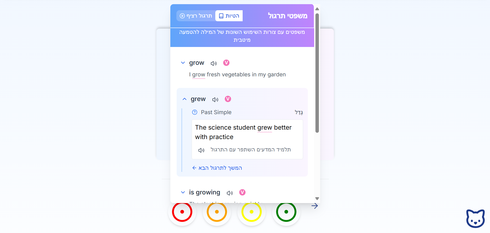

# Your English Bridge 🌉 

  

## Introduction
Your English Bridge is a continuation of 'Learn English Project' - a personal project I developed in Python. The project offers an innovative and unique approach to learning the English language, with emphasis on effective and personalized learning.  

## 🎯 Project Goal
Developing an innovative platform for learning English focusing on the 2,500 most useful words, while incorporating advanced technologies and innovative learning methods.  

## 🏗️ Development Principles
- **Production Ready**: Using modern tools and infrastructure
- **User-Centered Experience**: User-focused design and implementation
- **Innovation**: Creative solutions based on in-depth research
- **Integration**: Holistic approach combining all tools into a unified system  

## 💡 System Advantages
- Focus on clear goals
- Personal customization for users
- Implementation in a broad context
- Emphasis on motivation
- Strengthening long-term memory
- Detailed progress tracking  

## 🛠️ Technologies
- **Frontend**: React, Next.js
- **Backend**: Next.js
- **Styling**: Tailwind CSS
- **Database**:  
  - MongoDB (general information)  
  - Supabase (user data)
- **Authentication**: next-auth, Google Authenticator  

## 📚 Site Structure  

### Fully Developed
- Main word presentation and memorization page
- Useful word lists
- Level assessment
- Service pages (about, contact)  

### In Development
- Homepage
- Informational pages
- Registration page
- Review and implementation page  

### Future Development
- English for beginners
- English for advanced learners  

## ✨ Existing Features  

### Advanced Word Card
- Inflections and derivatives
- Example sentences with highlighting
- Translations
- Voice pronunciation
- Extended grammatical information
- Expressions and synonyms  

### Smart Learning System
- Navigation by index
- Rating words in 4 levels
- Automatic progress saving
- Personalized pace adjustment
- Tracking challenging words  

### Practice and Implementation Tools
- Reading: Personalized stories
- Listening: AI-powered reading aloud
- Writing: Completion exercises
- Speaking: Self-recording and monitoring  

## 🚀 Future Features
- Real-time AI feedback
- Advanced progress analysis
- Dynamic timeframe
- Advanced search
- Social platform for learners  

## 📊 Project Status
- **Feature Development**: Continuously updating
- **Design**: 50% completed
- **Responsiveness**: 80% completed  

---
*The project is in active development. I would appreciate feedback from the community!*